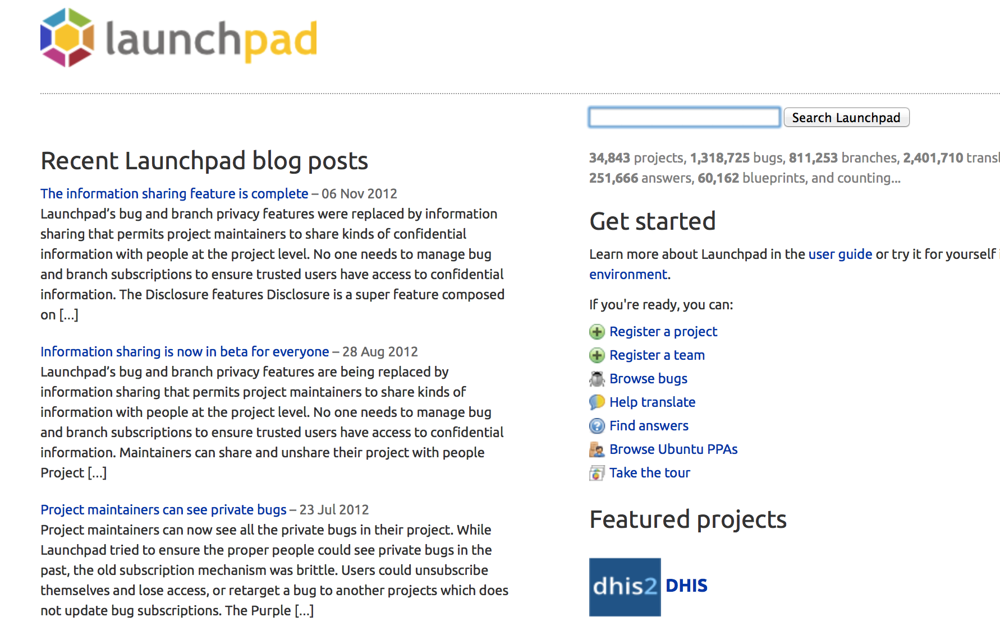

****************
Compte Launchpad
****************

Création d'un compte launchpad
==============================

Tout développeur elementary se doit d'avoir un compte sur Launchpad. Launchpad 
est la plateforme de Canonical pour l'hébergement de projet, suivi de bugs..etc.

Bien sûr si vous avez déjà un compte launchpad, vous pouvez passer cette partie.

    
    
Pour créer un compte cliquez en haut à droite sur Create account.ou aller 
directement sur https://login.launchpad.net/+login

.. figure:: _static/launchpad-login.png
    :align: center

Après rien de bien compliqué, vous pouvez compléter les infos de votre compte à votre guise.

Création d'une clé SSH et ajout au compte Launchpad
===================================================

Maintenant nous avons un compte Launchpad, nous allons en profiter pour lui ajouter une paire 
de clé ssh. Dans un premier nous allons générer ces clés. Ces clés sont une sorte de reconnaissance 
digitale de votre ordinateur et importer la clé publique à Launchpad assurera un gain de sécurité 
quand vous modifier votre code (de toute façon c'est obligatoire).

On vas installer l'outil nécessaire pour générer la clé et ensuite créer cette dernière, avec Terminal :

.. code-block:: bash

   $ sudo apt-get install openssh-client
   $ ssh-keygen -t rsa

Suivez les instructions, à un moment on vous demandera une passphrase, retenez le bien car
c'est le mot de passe qui sera demandé quand vous enverrez vos modifications de code vers Launchpad.

Votre clé publique est donc créée et nous allons l'ajouter à Launchpad.

Rendez-vous sur votre page Launchpad de clé SSH : https://launchpad.net/people/+me/+editsshkeys

Avec Terminal, nous allons ouvrir le fichier comportant la clé publique :
.. code-block:: bash

   $ scratch-text-editor ~/.ssh/id_rsa.pub
   
Copier le contenu du fichier pour le coller dans la zone adéquate sur la page Launchpad :

.. figure:: _static/ssh-key.png
    :align: center

Ensuite vous n'avez plus qu'à cliquer sur le bouton. Si vous comptez développer sur plusieurs machines,
il faudra importer chaque clé par ordinateur.

Maintenant on peut vérifier si tout vas bien avec bzr. Bazaar (ou bzr en ligne de commande)
est le gestionnaire de gestion de code utilisé sur Launchpad, nous verrons plus loin comment
l'utiliser avec Launchpad. Toutefois, on peut déjà signaler à bzr quel est notre identité Launchpad,
Remplacez your-launchpad-id par votre nom d'utilisateur Launchpad.

Nous avons déjà quelques outils, commençons par créer un exemple de projets.
