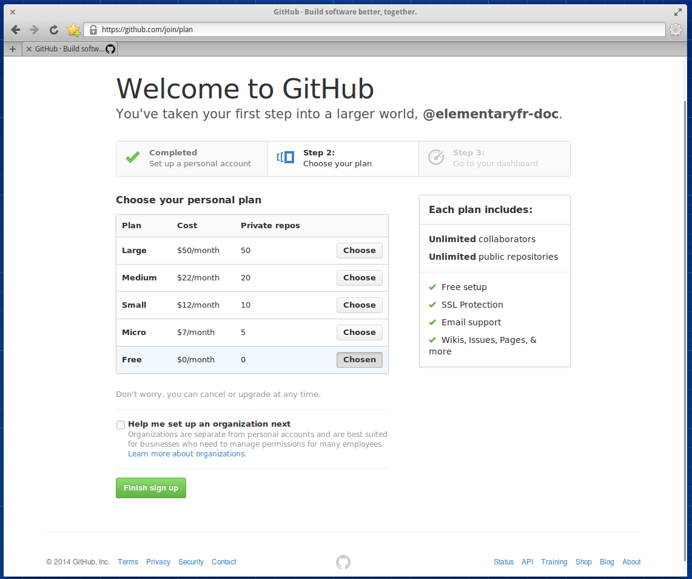
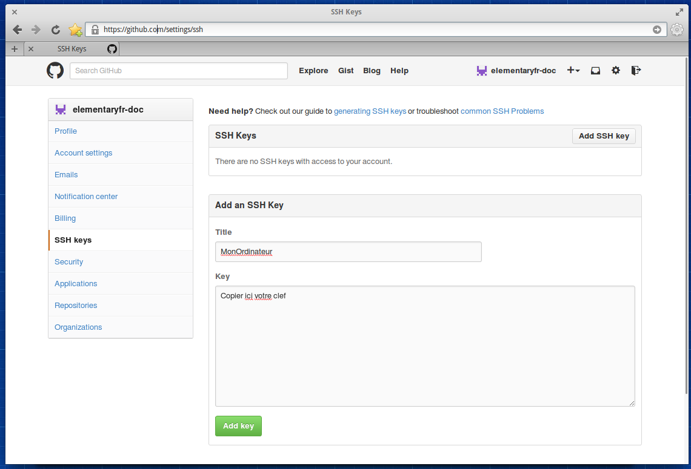

*************
Mise en route
*************

Gestion du codes
=================

Installation et configuration de Git
------------------------------------

Tous projet logiciel sérieux doit utiliser un logiciel de versions. Ce logiciel
va vous permettre de sauvegarder votre code, de revenir en arrière en cas
d'erreur et même de travailler en équipe.

Dans la communauté francophone, nous préférons utiliser le logiciel Git. On
peut facilement l'installer avec la commande suivante:

.. code-block:: bash

   $ sudo apt install git

Avant de passer à l'étape suivante, il faut encore configurer Git. 

Nous allons tous d'abors ajoutter notre nom réel et notre addresse email.
C'est très important, d'un point de vue légale, il est important de savoire 
qui a fait quoi dans un logiciel. Pour se faire, il faut lancer les commandes 
suivantes:

.. code-block:: bash

   $ git config --global user.name "John Smith"
   $ git config --global user.email "votre_email@example.com"

Et avant de continuer, une dernière petite configuration. On va demander
à Git d'utiliser le mode simple pour la synchronisation avec les serveurs git.

.. code-block:: bash

   git config --global push.default simple

Création d'un compte Github
---------------------------

Afin de toujours avoir une sauvegarde en ligne et de pouvoir travailler à
plusieur, il est important de publier nos fichiers sur internet. Pour se faire,
nous utilisons Github, qui est gratuit pour les projets sous licence libre.

Si vous n'avez pas déjà un compte, rendez vous à l'adresse suivante:
https://github.com/

Sur la page qui apparait, remplisser le formulaire avec un nom d'utilisateur,
votre email et un mot de passe.

.. figure:: _static/mise-en-route/github-signup.png
    :align: center

Il ne vous reste plus qu'à cliquer sur le bouton signup.

Sur la page suivante, cliquer sur Finish sign up en laissant les choix par défaut.

Et voilà, la création du compte est finie.

.. figure:: _static/mise-en-route/github-welcome-screen.png
    :align: center

Gestion de la destribution
==========================

Création d'un compte launchpad
------------------------------

Tout développeur elementary se doit d'avoir un compte sur Launchpad.
Launchpad est la plateforme de gestion du projet Ubuntu, sur lequel se
base Elementary OS. Cette plateforme permet de distribuer facilement nos
logiciels en les intégrants dans l'application Software Center.

Bien sûr si vous avez déjà un compte, vous pouvez passer cette partie.

.. figure:: _static/mise-en-route/launchpad.png
    :align: center
    
    
Pour créer un compte cliquez en haut à droite sur Create account.ou aller 
directement sur https://login.launchpad.net/+login

.. figure:: _static/mise-en-route/launchpad-login.png
    :align: center

Après rien de bien compliqué, vous pouvez compléter les infos de votre compte à votre guise.

Authentification par clé SSH
============================

Création d'une clé SSH
----------------------

Maintenant nous avons un compte Launchpad, nous allons en profiter pour lui ajouter une paire 
de clé ssh. Dans un premier temps, nous allons générer ces clés. Ces clés sont une sorte de reconnaissance 
digitale de votre ordinateur. Une fois la clé publique importée sur Launchpad, celui-ci reconnaitra
automatiquement votre machine, lorsque vous communiquerez avec lui depuis la ligne de commande.

On va installer l'outil nécessaire pour générer la clé et ensuite créer cette dernière, avec Terminal :

.. code-block:: bash

   $ sudo apt-get install openssh-client
   $ ssh-keygen -t rsa

.. NOTE::
   Par convention, on préfixe souvent les commandes au terminal par un $. Il ne faut pas copier
   ce caractère, sinon la commande ne fonctionnera pas.

Suivez les instructions, à un moment on vous demandera un mot de passe, retenez le bien car
il vous sera demandé lorsque vous enverrez vos modifications de code vers Launchpad.

Ajout de la clef sur Launchpad
-------------------------------

Votre clé publique est donc créée et nous allons l'ajouter à Launchpad.

Rendez-vous sur la page de gestion des clés SSH de votre compte : https://launchpad.net/people/+me/+editsshkeys

Avec Terminal, nous allons ouvrir le fichier comportant la clé publique :

.. code-block:: bash

   $ scratch-text-editor ~/.ssh/id_rsa.pub
   
Copier le contenu du fichier pour le coller dans la zone adéquate sur la page Launchpad :

.. figure:: _static/mise-en-route/ssh-key.png
    :align: center

Ensuite vous n'avez plus qu'à cliquer sur le bouton. Si vous comptez développer sur plusieurs machines,
il faudra importer chaque clé par ordinateur.

Maintenant on peut vérifier si tout va bien avec bzr. Bazaar (ou bzr en ligne de commande)
est le gestionnaire de gestion de code utilisé sur Launchpad, nous verrons plus loin comment
l'utiliser avec Launchpad. Toutefois, on peut déjà signaler à bzr quel est notre identité Launchpad,
Remplacez your-launchpad-id par votre nom d'utilisateur Launchpad.

.. code-block:: bash

   $ sudo apt-get install bzr
   $ bzr launchpad-login your-launchpad-id

Ajout de la clef sur Github
---------------------------

De la manière, aller sur la page suivante: https://github.com/settings/ssh

Une fois dessus, un click sur le bouton "Add SSH Key" va vous permettre
d'ajouter votre clef.

Installation du SDK d'Elementary OS
===================================

Une application Elementary est crée en utilisant certaines technologies, qui rendront votre projet
intégré au système. En réutilisant ces outils. vos applications ressembleront à celle que vous avez
déjà sur votre machine.

Pour installer ces outils de développement, lancer la commande suivante:

.. code-block:: bash

   $ sudo apt-get build-dep granite-demo

Avec cette commande nous allons installer les dépendances de construction de granite-demo qui
seront suffisantes pour compiler un projet de base.
