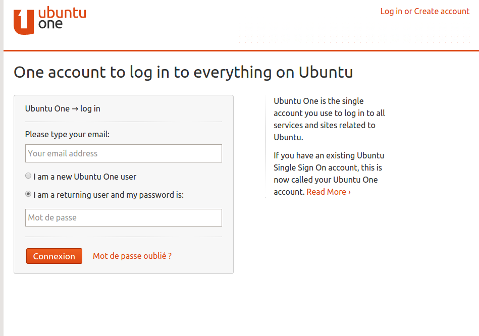
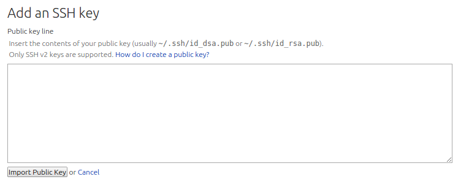

*************************************************
Mise en route de l'environnement de développement
*************************************************

Création d'un compte launchpad
==============================

Tout développeur elementary se doit d'avoir un compte sur Launchpad. Launchpad 
est la plateforme de Canonical pour l'hébergement de projet, suivi de bugs, ...

Bien sûr si vous avez déjà un compte, vous pouvez passer cette partie.

.. figure:: _static/mise-en-route/launchpad.png
    :align: center
    
    
Pour créer un compte cliquez en haut à droite sur Create account.ou aller 
directement sur https://login.launchpad.net/+login

Après rien de bien compliqué, vous pouvez compléter les infos de votre compte à votre guise.

Création d'une clé SSH et ajout au compte Launchpad
----------------------------------------------------

Maintenant nous avons un compte Launchpad, nous allons en profiter pour lui ajouter une paire 
de clé ssh. Dans un premier temps, nous allons générer ces clés. Ces clés sont une sorte de reconnaissance 
digitale de votre ordinateur. Une fois la clé publique importée sur Launchpad, celui-ci reconnaitra
automatiquement votre machine, lorsque vous communiquerez avec lui depuis la ligne de commande.

On va installer l'outil nécessaire pour générer la clé et ensuite créer cette dernière, avec Terminal :

.. code-block:: bash

   $ sudo apt-get install openssh-client
   $ ssh-keygen -t rsa

   .. NOTE::
      Par convention, on préfixe souvent les commandes au terminal par un $. Il ne faut pas copier
      ce caractère, sinon la commande ne fonctionnera pas.

Suivez les instructions, à un moment on vous demandera un mot de passe, retenez le bien car
il vous sera demandé lorsque vous enverrez vos modifications de code vers Launchpad.

Votre clé publique est donc créée et nous allons l'ajouter à Launchpad.

Rendez-vous sur la page de gestion des clés SSH de votre compte : https://launchpad.net/people/+me/+editsshkeys

Avec Terminal, nous allons ouvrir le fichier comportant la clé publique :

.. code-block:: bash

   $ scratch-text-editor ~/.ssh/id_rsa.pub
   
Copier le contenu du fichier pour le coller dans la zone adéquate sur la page Launchpad :

Ensuite vous n'avez plus qu'à cliquer sur le bouton. Si vous comptez développer sur plusieurs machines,
il faudra importer chaque clé par ordinateur.

Maintenant on peut vérifier si tout va bien avec bzr. Bazaar (ou bzr en ligne de commande)
est le gestionnaire de gestion de code utilisé sur Launchpad, nous verrons plus loin comment
l'utiliser avec Launchpad. Toutefois, on peut déjà signaler à bzr quel est notre identité Launchpad,
Remplacez your-launchpad-id par votre nom d'utilisateur Launchpad.

.. code-block:: bash
   $ sudo apt-get install bzr
  $ bzr launchpad-login your-launchpad-id


Installation du SDK d'Elementary OS
===================================

Une application Elementary est crée en utilisant certaines technologies, qui rendront votre projet
intégré au système. En réutilisant ces outils. vos applications ressembleront à celle que vous avez
déjà sur votre machine.

Pour installer ces outils de développement, lancer la commande suivante:

.. code-block:: bash

   $ sudo apt-get build-dep granite-demo

Nous avons déjà quelques outils, commençons par créer un exemple de projets.
