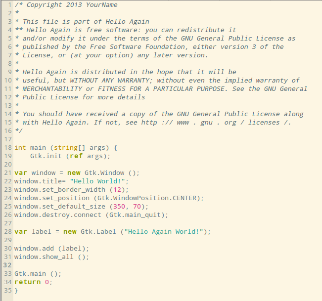
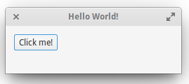
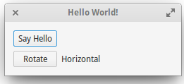
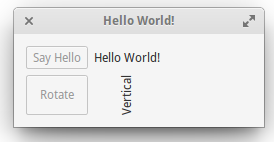

******************************
Plus de possibilités avec Vala
******************************

Dans cette partie nous allons nous amuser un peu avec Vala ets es possibilités vis à vis de Gtk.
Nous verrons la fonction Gtk.Grid et Attach. Bien sûr vous trouverez plein d'infos sur
http://valadoc.org/
Reprenez votre fichier hello-again.vala

Gtk.Grid
========

Cette fois au lieu d'ajouter un bouton ou label, nous allons utiliser Gtk.Grid qui peut être
considéré comme une sorte de grille. Voici le code à insérer :

.. code-block:: vala
   :linenos:

   var grid = new Gtk.Grid ();
   grid.orientation = Gtk.Orientation.VERTICAL;

On a donc une nouvelle variable nommée grid qui est un Gtk.Grid ayant une orientation, si on
avait pas mis cette seconde ligne, la grille serait automatiquement en position horizontale (valeur
par défaut)
On peut ajouter des labels à l'intérieur de cette grille :

.. code-block:: vala
   :linenos:

   grid.add (new Gtk.Label ("Label 1"));
   grid.add (new Gtk.Label ("Label 2"));

Puis enfin on ajouter notre variable grid à la fenêtre principale :

.. code-block:: vala
   :linenos:
   
   this.add (grid);

Au final, si vous avez tout compris vous devriez avoir un fichier comme ceci :Ensuite on compile et on teste, souvenez-vous :

.. code-block:: bash

   $ valac --pkg gtk+-3.0 hello-again.vala
   $ ./hello-again

Et voici l'application :

Regardez bien, on a donc une grille de position verticale et avec un label dans chaque cellule.
Maintenant voyons un autre exemple :

.. code-block:: vala
    :linenos:
   
    var grid = new Gtk.Grid ();
    grid.orientation = Gtk.Orientation.VERTICAL;
    grid.row_spacing = 6;
   
    var button = new Gtk.Button.with_label ("Click me!");
    var label = new Gtk.Label (null);
   
    grid.add (button);
    grid.add (label);
   
    window.add (grid);

Toujours une grille verticale et avec un espacement de 6 pour chaque cellule. On ajoute un
bouton (avec le label Click me !) et un label vide. Puis on ajoute les variables button et label à la
grille.
Voici le résultat :

On retrouve notre grille avec le bouton Click me dans la première cellule.
Définissons une action sur le bouton, après window.add (grid), rajoutez ce code :

.. code-block:: vala
   :linenos:
   
   button.clicked.connect (() => {
     label.label = "Hello World!";
     button.sensitive = false;
   
   });

Ici on veut qu'une fois cliqué le bouton affiche un label Hello World ! Avec le sensitive sur false, le
bouton restera « enfoncé ».
Démonstration :

.. figure:: _static/plus-de-possibilites-avec-vala/Bouton-enfonce.png
    :align: center

Amusez-vous à changer des valeurs, par exemple le sensitive sur true, virer la ligne de position
verticale...etc :-)

Attach
======

Nous allons voir la méthode de placement des widgets par la fonction attach.
On vas tester une autre grille :

.. code-block:: vala
    :linenos:
   
    var layout = new Gtk.Grid ();
    layout.column_spacing = 6;
    layout.row_spacing = 6;
   
    var hello_button = new Gtk.Button.with_label ("Say Hello");
    var hello_label = new Gtk.Label (null);
   
    var rotate_button = new Gtk.Button.with_label ("Rotate");
    var rotate_label = new Gtk.Label ("Horizontal");

Nous avons :
- une grille nommé layout
- les colonnes et les cellules sont espacées de 6
- un bouton (hello_button) avec le label Say Hello
- un label (hello_label) vide
- un bouton (rotate_button) avec le label Rotate
- un label (rotate_label) qui indique Horizontal

Ensuite n'oubliez pas qu'il faut ajouter tout ce petit monde en respectant le nom des variables :

.. code-block:: vala
    :linenos:
   
    layout.add (hello_button);
    layout.add (hello_label);
    layout.add (rotate_button);
    layout.add (rotate_label);
   
    window.add (layout);

Voilà le résultat :

.. figure:: _static/plus-de-possibilites-avec-vala/attach-ligne.png
    :align: center

Nous avons bien notre grille comportant la première cellule avec le bouton Say Hello, la seconde
est visuellement omise car elle affiche un label vide, la troisième avec le bouton rotate et enfin la
quatrième avec le label affichant le mot Horizontal.

La fonction add rajoute bêtement vos widgets mais avec attach on peut avoir davantage de
possibilités, regardons cela !
Remplacez ce morceau :

.. code-block:: vala
    :linenos:
   
    layout.add (hello_button);
    layout.add (hello_label);
    layout.add (rotate_button);
    layout.add (rotate_label);

Par :

.. code-block:: vala
    :linenos:
   
    // ajout d'un premier lot de widgets
    layout.attach (hello_button, 0, 0, 1, 1);
    layout.attach_next_to (hello_label, hello_button, Gtk.PositionType.RIGHT, 1, 1);
   
    // ajout d'un second lot de widgets
    layout.attach (rotate_button, 0, 1, 1, 1);
    layout.attach_next_to (rotate_label, rotate_button, Gtk.PositionType.RIGHT, 1, 1);

Dans un premier temps on rajoute hello_button puis on lui attache hello_label positionné à sa
droite.
Dans un second temps et avec le même principe, on ajoute rotate_button avec rotate_label situé
à sa droite.
La fonction attach_next_to permet de placer un widget à côté d'un autre. Le tout sera placé donc
dans une grille 2x2.
Le résultat :

Notez qu'attach répond à 5 arguments, exemple au-dessus avec : 0, 0, 1, 1
Dans l'ordre :
1 : Correspond au widget que vous rattachez à la grille.
2 : Le nombre de colonne (qui débute à 0).
3 : Le nombre de cellules (qui débute à 0).
4 : Le nombre de colonne où le widget peut s'étendre.
5 : Le nombre de cellule où le widget peut s'étendre.
On peut aussi ajouter des fonctions à nos boutons le code suivant après le window.add (layout) ;

.. code-block:: vala
    :linenos:
   
    hello_button.clicked.connect (() => {
      hello_label.label = "Hello World!";
      hello_button.sensitive = false;
   
    });
   
    rotate_button.clicked.connect (() => {
      rotate_label.angle = 90;
      rotate_label.label = "Vertical";
      rotate_button.sensitive = false;
   
    });

Le bouton hello_button affichera un label Hello World ! Il restera enfoncé.
Le bouton rotate_button affichera un label Vertical pivoté à 90° et restera enfoncé.
Démonstration :

Voilà, n'hésitez pas à consulter Valadoc pour découvrir d'autres fonctions :-)
