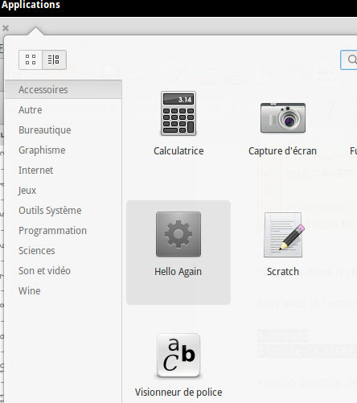

**************
Premier projet
**************

De retour dans notre dossier Projects, on crée un sous-dossier hello-world

.. code-block:: bash

   $ mkdir hello-world

Puis dedans on crée un autre dossier pour notre nouvelle application.

.. code-block:: bash

   $ cd hello-world
   $ mkdir hello-again

Créeons le dossier src puis éditons notre nouveau fichier hello-again.vala

.. code-block:: bash
   
   $ cd hello-again
   $ mkdir src
   $ cd src
   $ touch hello-again.vala
   $ scratch-text-editor hello-again.vala

Nous allons écrire un entête pour le copyright comme pour une vraie application :

.. code-block:: bash
   :linenos:

   /***
    Copyright © 2014 Votre nom <email@example.com>

    This file is part of Hello Again.

    Hello Again is free software: you can redistribute it and/or
    modify it under the terms of the GNU General Public License as published
    by the Free Software Foundation, either version 3 of the License, or
    (at your option) any later version.

    Hello Again is distributed in the hope that it will be useful,
    but WITHOUT ANY WARRANTY; without even the implied warranty of
    MERCHANTABILITY or FITNESS FOR A PARTICULAR PURPOSE.  See the
    GNU General Public License for more details.

    You should have received a copy of the GNU General Public License
    along with Hello Again. If not, see <http://www.gnu.org/licenses/>.
   ***/
    
Cette fois on reprend la même structure de base que gtk-hello.vala mais on vas juste mettre un Gtk.Label au lieu d'un Gtk.Button :

.. code-block:: vala

   var label = new Gtk.Label ("Hello Again World!");

Et pensez à l'ajouter à votre fenêtre ! Donc si vous avez pigé, vous avez déjà écris:
window.add (label);

Si vous avez fait comme il fallait, vous devriez avoir ceci :

.. code-block:: vala
   :linenos:

   /***
    Copyright © 2014 Votre nom <email@example.com>

    This file is part of Hello Again.

    Hello Again is free software: you can redistribute it and/or
    modify it under the terms of the GNU General Public License as published
    by the Free Software Foundation, either version 3 of the License, or
    (at your option) any later version.

    Hello Again is distributed in the hope that it will be useful,
    but WITHOUT ANY WARRANTY; without even the implied warranty of
    MERCHANTABILITY or FITNESS FOR A PARTICULAR PURPOSE.  See the
    GNU General Public License for more details.

    You should have received a copy of the GNU General Public License
    along with Hello Again. If not, see <http://www.gnu.org/licenses/>.
   ***/

   int main (string[] args) {
       Gtk.init (ref args);

       var window = new Gtk.Window ();
       window.title = "Hello World!";
       window.set_border_width (12);
       window.set_position (Gtk.WindowPosition.CENTER);
       window.set_default_size (350, 70);
       window.destroy.connect (Gtk.main_quit);

       var label = new Gtk.Label ("Hello Again World!");

       window.add (label);
       window.show_all ();

       Gtk.main ();
       return 0;
   }

Compiler l'appli et testez là !

.. code-block:: bash

   $ valac --pkg gtk+-3.0 hello-again.vala
   $ ./hello-again

Tadaa !

.. figure:: _static/premiere-application/gtk-hello-again.png
    :align: center

Notre première application fonctionne et nous allons la mettre sur Launchpad,
reprenez les commandes indiquées en partie 2.2 mais cette fois nous mettrons ce 
fichier sur un autre dépôt :

.. code-block:: bash

   $ bzr push lp:~votre-login-launchpad/+junk/hello-again

Cous pouvez vérifier si cela a bien marché en allant sur launchpad :
https://code.launchpad.net/people/+me/

Maintenant nous allons créer des fichiers indispensables pour agrémenter notre application

Les fichiers indispensables
===========================

Nous allons rajouter à notre application un raccourci qui apparaîtra dans le menu Applications.
On vas déjà créer un dossier data dans notre dossier hello-again

.. code-block:: bash

   $ mkdir data

Entrons dedans et créons un fichier .desktop

.. code-block:: bash

   $ cd data
   $ touch hello-again.desktop
   $ scratch-text-editor hello-again.desktop

Ce type de fichier répond à des normes spécifiques pour elementary, elles sont consultables ici :
http://elementaryos.org/docs/human-interface-guidelines/app-launchers

Passons à l'écriture :

.. code-block:: text
   :linenos:

   [Desktop Entry]
   Name=Hello Again
   GenericName=Hello World App
   Comment=Proves that we can use Vala and Gtk
   Categories=GTK;Utility;
   Exec=hello-again
   Icon=application-default-icon
   Terminal=false
   Type=Application
   X-GNOME-Gettext-Domain=hello-again
   X-GNOME-Keywords=Hello;World;Example;

Don rapidement, on a crée un raccourci par rapport à notre application Hello Again comportant
un nom, un nom générique, une description, la commande d'exécution, l'icône qui sera utilisée,
le type...

Vous pouvez déjà commiter ce nouveau fichier :

.. code-block:: bash

   $ cd ..
   $ bzr add data/hello.desktop
   $ bzr commit -m "Added a .desktop file"
   $ bzr push

Notez qu'il suffit juste d'utiliser push maintenant que bzr sait sur quel dépôt de code il doit
envoyer les modifications.

Maintenant nous allons aborder la partie « juridique » de la chose. À la racine du projet on crée
deux fichiers : AUTHORS et COPYING (en lettres capitales!)

Dans AUTHORS, on indique tous les participants du projet, de cette façon :

.. code-block:: text
   :linenos:

   votre Nom <vous@emailaddress.com>
   Votre Ami <ami@emailaddress.com>

Dans COPYING, on place la licence du projet, pour info les applications elementary utilisent
généralement la GPL : http://www.gnu.org/licenses/quick-guide-gplv3.html

Vous pouvez récupérer le COPYING de mon dépôt :
http://bazaar.launchpad.net/~devil505/+junk/hello-packaging/view/head:/COPYING

Maintenant vous pouvez commiter ces deux fichiers comme nous l'avons fait pour le fichier
.desktop

Maintenant attardons-nous la compilation de notre application.

La compilation
==============

Pour la compilation nous allons utiliser Cmake http://www.cmake.org/ qui est utilisé par la
plupart des applications elementary.

Cmake et ses modules se trouve sur un dépôt d'elementary que nous allons récupérer, placez-
vous le dossier ~/Projects.

.. code-block:: bash

   $ bzr branch lp:~elementary-apps/+junk/cmake-modules

Dans le dossier cmake-modules, vous avez un dossier cmake, copiez-le et collez-le dans le dossier
hello-again.

Dans le dossier hello-again, on crée un fichier CmakeLists.txt

.. code-block:: bash

   $ touch CmakeListe.txt
   $ scratch-text-editor CmakeLists.txt

Dans ce fichier copiez ce qui suit, pas avec les commentaires qui sont là pour vous expliquer à
corresponde telles ou telles lignes :

.. code-block:: cmake
   :linenos:

   # le nom du projet
   project (hello-again)

   # la version moins récente de cmake que nous pouvons supporter
   cmake_minimum_required (VERSION 2.6)

   # dire à cmake quels modules sont présents dans le dossier de notre projet
   list (APPEND CMAKE_MODULE_PATH ${CMAKE_SOURCE_DIR}/cmake)

   # où installer le dossier data si besoin est
   set (DATADIR "${CMAKE_INSTALL_PREFIX}/share")

   # ici on dit où installer le projet
   set (PKGDATADIR "${DATADIR}/hello-again")

   set (EXEC_NAME "hello-again")
   set (RELEASE_NAME "A hello world.")
   set (VERSION "0.1")
   set (VERSION_INFO "whats up world")

   # on vas utiliser pkgconfig pour vérifier que les dépendances sont installées, mais avant, allons le chercher
   find_package(PkgConfig)

   # maintenant vérifions les dépendances requises
   pkg_check_modules(DEPS REQUIRED gtk+-3.0)

   add_definitions(${DEPS_CFLAGS})
   link_libraries(${DEPS_LIBRARIES})
   link_directories(${DEPS_LIBRARY_DIRS})

   # pour être sûr que nous avons vala
   find_package(Vala REQUIRED)
   # pour être sûr qu'on utilise vala
   include(ValaVersion)
   # pour être sûr de la version de vala utilisée36. ensure_vala_version("0.16" MINIMUM)

   # les fichiers que nous voulons compiler
   include(ValaPrecompile)
   vala_precompile(VALA_C ${EXEC_NAME}

   src/hello-again.vala

   # on dit quelles bibliothèques utilisées pour la compilation
   PACKAGES

      gtk+-3.0
   )

   # on dit à cmake d'appeler l'éxécutable que nous venons de créer
   add_executable(${EXEC_NAME} ${VALA_C})

   # ceci installe le binaire résultant de la compilation
   install (TARGETS ${EXEC_NAME} RUNTIME DESTINATION bin)

   # ceci installe le fichier .desktop pourqu'il soit disponible dans le menu Applications
   install (FILES ${CMAKE_CURRENT_SOURCE_DIR}/data/hello.desktop DESTINATION ${DATADIR}/applications/)

Toujours dans le dossier hello-again, on crée un dossier nommé build.

Puis avec le Terminal dans ce dossier, nous allons lancer la construction par Cmake :

.. code-block:: bash

   $ cd build
   $ cmake -DCMAKE_INSTALL_PREFIX=/usr ../

Puis on compile de manière classique :

.. code-block:: bash

   $ make

Enfin, on vas même installer notre application :

.. code-block:: bash

   $ sudo make install

Vous avez donc deux nouveaux fichiers dans votre système :

.. code-block:: text

   /usr/bin/hello-again
   /usr/share/applications/hello.desktop

Regardez dans votre menu Applications :

Faire un paquet 
===============

Nous avons maintenant une application simple mais complète. Essayons d'en faire un paquet
qui sera disponible à tous sur votre dépôt PPA.

On va créer un nouveau dossier dans hello-world dédié au packaging et nous allons l'appeler :
deb-packaging

Dans deb-packaging nous allons copier le contenu de notre application hello-again
(src,data,cmake,AUTHORS,COPYING,CmakeLists,txt) sauf le dossier build.

Nous allons avoir besoin de fichiers spécifiques aux paquets debian et nous allons les chercher
avec bzr mais avant revenez dans ~/Projects pour ne pas tout mélanger :

.. code-block:: bash

   $ cd ~/Projects
   $ bzr branch lp:~elementary-apps/+junk/debian-template

Dans le dossier debian-template se trouve un dossier debian que vous copier dans deb-
packaging. 

Puis aller dans ~/Projects/hello-world/deb-packaging/debian et regardez le fichier
changelog. Ce fichier doit être mis à jour à chaque nouvelle version de votre futur paquet.

Comme votre application en est sa premiès version, ce fichier doit ressembler à ceci :

.. code-block:: text
   :linenos:

   hello-packaging (0.1) precise; urgency=low
   
   * Initial Release.
   
   -- Your Name <you@emailaddress.com> Tue, 9 Apr 2013 04:53:39 -0500

.. TIP::

   On peut utiliser le programme dch pour générer les entées

En premier vous indiquez la version du paquet, la version d'ubuntu (Luna étant basée sur
Precise) et l'urgence de la construction par les serveurs de Launchpad. Ce n'est pas critique, donc
nous avons opté pour low,

Ensuite vous indiquez votre Nom et votre email. Enfin à la dernière ligne vous placez la date et
l'heure (ne pas oublier le fuseau horaire) actuelles.

Si vous sortez une nouvelle version de votre paquet, il ne faudra pas effacer ou remplacer ses
lignes, vous réécrivez un nouveau paragraphe de 5 lignes comme l'exemple en haut avec le
nouveau numéro de version, le nouvel horodatage...

Maintenant allons nous occuper du fichier control, ce fichier recueille les infos de votre futur
paquet .deb. Voici à qui il doit ressembler :

.. code-block:: text
   :linenos:

   Source: hello-again
   Section: x11
   Priority: extra
   Maintainer: Your Name <you@emailaddress.com>
   Build-Depends: cmake (>= 2.8),
   debhelper (>= 8.0.0),
   valac-0.24 | valac (>= 0.24),
   libgtk-3-dev (3.12.2)

   Standards-Version: 3.9.3

   Package: hello-again
   Architecture: any
   Depends: ${misc:Depends}, ${shlibs:Depends}
   Description: Hey young world
   This is a Hello World written in Vala using the Autovala build system.

Donc ici on indique le nom et l'email du mainteneur du paquet, les dépendances de construction,
les dépendances (notez la séparation par des virgules), la description de l'application...

Passons au fichier copyright que l'on va modifier pour obtenir ceci :

.. code-block:: text
   :linenos:

   Format: http://dep.debian.net/deps/dep5
   Upstream-Name: hello-again3.
   Source: https://code.launchpad.net/~junrrein/+junk/hello-packaging

   Files: cmake/* data/* debian/* doc/* po/* src/*
   Copyright: 2014 Votre Nom
   License: GPL-3.0+

   License: GPL-3.0+
   This program is free software: you can redistribute it and/or modify
   it under the terms of the GNU General Public License as published by
   the Free Software Foundation, either version 3 of the License, or
   (at your option) any later version.
   .
   This package is distributed in the hope that it will be useful,
   but WITHOUT ANY WARRANTY; without even the implied warranty of
   MERCHANTABILITY or FITNESS FOR A PARTICULAR PURPOSE. See the
   GNU General Public License for more details.
   .
   You should have received a copy of the GNU General Public License
   along with this program. If not, see <http://www.gnu.org/licenses/>.
   .
   On Debian systems, the complete text of the GNU General
   Public License version 3 can be found in "/usr/share/common-licenses/GPL-3".

Pour plus de détails sur le packaging Debian, consulter ce lien :
http://www.debian.org/doc/debian-policy/

Maintenant, nous allons nous occuper des recettes Launchpad (recipes en anglais) pour la
construction de votre paquet.

Rendez-vous sur cette page : 
https://code.launchpad.net/people/+me/+junk/deb-packaging/+new-recipe

Ici cochez les options comme vous le désirez, le plus important étant la case Recipe Text dont
vous allez effacer le contenu par défaut pour le remplacer par :

.. code-block:: text

   # bzr-builder format 0.3 deb-version {debupstream}+r{revno}-0

Ensuite appuyer sur Create Recipe.

Les serveurs de Launchpad vont crée les paquets pour les différentes architectures et pour les
différentes versions d'Ubuntu que vous aurez choisi au moment de la création de la recipe.

Vous ne devrez pas tarder à voir votre paquet sur votre dépôt PPA :
https://launchpad.net/people/+me/+archive/ubuntu/deb-packaging

Et voilà vous avez packagé votre application !
