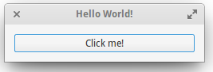

********************
Première application
********************

Dans un premier temps nous allons créer dans le dossier personnel, un dossier où seront situés
tout vos projets et on le nommera Projects comme les pros sur elementary:D

.. code-block:: bash

   $ mkdir ~/Projects

Nos outils seront l'éditeur de texte Scratch pour écrire notre code et Terminal pour exécuter
certaines commandes. Ces deux applications sont installées apr défaut sur elementary OS.

Bases de Vala
==============

Nous allons créer un petit projet tout simple en Vala, le code utilisé pour les applications
elementary. Notre projet sera un simple Hello World dans une fenêtre GTK.
Créons le dossier pour ce projet puis un sous-dossier src où nous mettrons notre fichier Vala
comportant notre code.

.. code-block:: bash

   $ cd ~/Projects
   $ mkdir gtk-hello
   $ cd gtk-hello
   $ mkdir src

Avec Scratch nous allons créer notre fichier vala et commencer son écriture :

.. code-block:: bash

   $ cd src
   $ scratch-text-editor gtk-hello.vala

Passons à l'écriture, tout d'abord nous mettons ce code pour initialiser notre code vala :

.. code-block:: vala
   :linenos:

   int main (string[] args) {
      Gtk.init (ref args);
   }

Maintenant nous allons insérer une fenêtre avec quelques paramètres à l'intérieur du code
précédent, donc avant le } ajoutez ceci :

.. code-block:: vala
   :linenos:

   var window = new Gtk.Window ();
   window.title = "Hello World!";
   window.set_border_width (12);
   window.set_position (Gtk.WindowPosition.CENTER);
   window.set_default_size (350, 70);
   window.destroy.connect (Gtk.main_quit);
   Gtk.main ();
   return 0;

Donc en résumé, on crée une fenêtre portant la variable window, qui aura pour titre HelloWorld !, avec une bordure de 12, positionner au centre de l'écran, avec une taille de 350x70, et
enfin si on ferme cette fenêtre l'action sera que l'on quitte l'application.

Ce n'est pas encore terminé, nous avons fenêtre principale mais nous allons lui ajouter un
bouton donc avant Gtk,main() on y ajoute ceci :

.. code-block:: vala
   :linenos:

   var button_hello = new Gtk.Button.with_label ("Click me!");
   button_hello.clicked.connect (() => {
      button_hello.label = "Hello World!";
      button_hello.set_sensitive (false);
   });
   
   window.add (button_hello);
   window.show_all ();

Donc ici, on ajoute un bouton nommé par la variable button_hello, qui aura comme étiquette
(label) Click Me ! Et quand on clique dessus cela affichera le label Hello World !.

Donc les deux dernières, on ajoute notre bouton à notre fenêtre, notez qu'on a réutilisé le même
nom de variable entre les parenthèses.
Au final vous devriez obtenir ceci :

.. figure:: _static/exemple-simple-de-projet/gtk-hello-vala.png
    :align: center

Maintenant on va compiler notre fichier vala (qui va créer un fichier éxécutable) et le tester. Si
des erreurs sont signalées, revérifiez votre code.

.. code-block:: bash

   $ valac --pkg gtk+-3.0 gtk-hello.vala
   $ ./gtk-hello
   
Et donc vous devriez avoir votre petite application :

Sympa non ?
Poussons notre code sur Launchpad maintenant !

Bazaar
======

Comme je l'avais dit plutôt Bazaar est le gestionnaire qui va vous permettre d'envoyer votre
code source sur un dépôt de code (à ne pas confondre avec les dépôts PPA) sur Launchpad.
Placez votre terminal au niveau de ~/Projects/gtk-hello,
On va déjà déclarer votre Pseudo et votre email, ceci est à faire une seule fois.

.. code-block:: bash

    $ bzr whoami "toto <toto@mail.com>"

Et là on remplace toto par votre pseudo et le mail qui va bien ;-)
On va initialiser notre dossier pour bzr

.. code-block:: bash

    $ bzr whoami "Devil505 <devil505linux@gmail.com>"
    $ bzr init

Et on va ajouter notre fichier (le dossier src sera aussi ajouté)

.. code-block:: bash

    $ bzr add src/gtk-hello.vala

Puis on va écrire un commit (message très résumé des modifications apportées au code)

.. code-block:: bash

    $ bzr commit -m "Create initial structure. Create window with button."

Et là on envoie notre fichier sur nôtre dépôt +junk/gtk-hello chez Launchpad, pensez à indiquer
votre login Launchpad dans la commande :

.. code-block:: bash

    $ bzr push lp:~votre-login-launchpad/+junk/gtk-helloEt

voilà, jetez un coup d'oeil sur Launchpad :
https://code.launchpad.net/people/+me/

Bien joué !
Il est temps de faire une application un peu plus complexe et surtout plus complète, et d'ensuite d'en faire un paquet.
