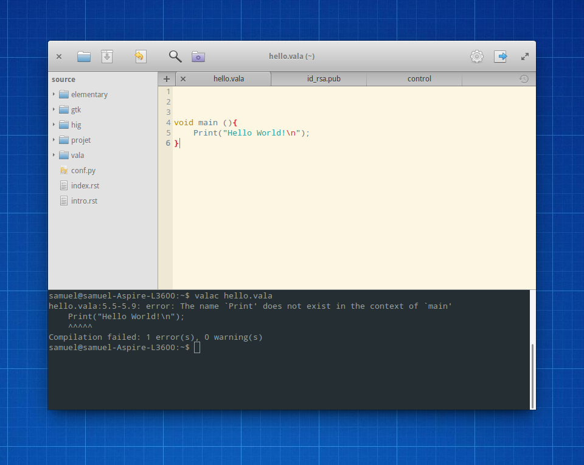

***************************
La syntaxe générale du Vala
***************************

Nous allons aborder ici la syntaxe générale du langage de programmation Vala dans
le cadre d’une application console. Il est en effet possible de créer plein de
choses différentes avec le Vala comme une application web, des jeux, etc.

Dans cette optique, nous allons utiliser très souvent l’instruction:
**print("…");** que nous avons vue au chapitre précédent et qui est une instruction
dédiée à l’affichage sur la console. C’est une instruction qui va s’avérer très
pratique pour notre apprentissage car nous pourrons avoir une représentation
visuelle de ce que nous allons apprendre.

Il est globalement rare qu’une application ne doive afficher que du texte, sans
aucune mise en forme. Vous verrez dans une autre partie comment réaliser des
applications un peu plus évoluées graphiquement.

Préparez vous, nous plongeons petit à petit dans l'univers du Vala. Dans ce
chapitre, nous allons nous attaquer à la syntaxe générale du Vala et nous serons
capable de reconnaître les lignes de code et de quoi elles se composent.

Ecrire une ligne de code
=========================

Les lignes de code écrites avec le langage de développement Vala doivent
s’écrire dans des fichiers dont l’extension est .vala, comme dans le chapitre
précédent, lorsque nous avons créer un fichier hello.vala. Nous y avons
notamment rajouté une instruction permettant d’afficher du texte.

Les lignes de code Vala se lisent et s’écrivent de haut en bas et
de gauche à droite, comme un livre normal.
Aussi, une instruction écrite avant une autre sera en général exécutée avant
celle-ci.

.. important::
   Attention, chaque ligne de code doit être syntaxiquement correcte sinon le
   compilateur ne saura pas la traduire en langage exécutable.

Par exemple, si à la fin de mon instruction, je retire le point-virgule ou si
j’orthographie mal le mot print, j’aurai le message d'erreur suivant:

Ce sont des erreurs de compilation qu’il va falloir résoudre si l’on souhaite
que l’application console puisse s’exécuter.

Nous allons voir dans les chapitres suivants comment écrire correctement des
instructions en Vala. Mais il est important de noter à l’heure actuelle que le
Vala est sensible à la casse, ce qui veut dire que les majuscules comptent !

Ainsi le mot « print » et le mot « Print » sont deux mots bien distincts et
peuvent potentiellement représenter deux instructions différentes.
Ici, le deuxième mot est incorrect car il n’existe pas.

Rappelez-vous bien que la casse est déterminante pour que l’application
puisse compiler.

Le caractère de terminaison de ligne
=====================================

En général, une instruction en code Vala s’écrit sur une ligne et se termine
par un point-virgule.

Ainsi, l’instruction que nous avons vue plus haut :

.. code-block:: vala

    print("Hello World!");

se termine au niveau du point-virgule.

Il aurait été possible de remplacer le code écrit :

.. code-block:: vala

   void main (){
       print("Hello World!");
   }

par :

.. code-block:: vala

   void main (){print("Hello World!");}

ou encore :

.. code-block:: vala

   void main (){

       print("Hello World!");

               }

.. note::
   En général, pour que le code soit le plus lisible possible, on écrit une
   instruction par ligne et on indente le code de façon à ce que les blocs
   soient lisibles.

.. note::
   Un bloc de code est délimité par des accolades { }. Nous y reviendrons
   plus tard.

   Indenter signifie que chaque ligne de code qui fait partie d’un même bloc de
   code commence avec le même retrait sur l’éditeur. Ce sont soit des
   tabulations, soit des espaces qui permettent de faire ce retrait.

   En général, les programmeurs Vala utilisent quatre espaces par niveau
   d'indentation.

Décortiquons à présent cette ligne de code :

.. code-block:: vala

    print("Hello World!");

Pour simplifier, nous dirons que nous appelons la méthode print qui permet
d’écrire une chaîne de caractères sur la console.

Une méthode représente une fonctionnalité, écrite avec du code, qui est
utilisable par d’autres bouts de code (par exemple, calculer la racine carrée
d'un nombre ou afficher du texte ...).

L’instruction "Hello World!" représente une chaine de caractères et est passée
en paramètre de la méthode print à l’aide des parenthèses. La chaîne de
caractères est délimitée par les guillemets. Enfin, le point-virgule permet
d’indiquer que l’instruction est terminée et que l’on peut enchaîner sur la
suivante.

Certains points ne sont peut-être pas encore tout à fait clairs, comme ce
qu’est vraiment une méthode, ou comment utiliser des chaînes de caractères.
Mais ne vous inquiétez pas, nous allons y revenir plus en détail dans les
chapitres suivants et découvrir au fur et à mesure les arcanes du Vala.

Les commentaires
================

Pour faciliter la compréhension du code ou pour se rappeler un point précis,
il est possible de mettre des commentaires dans son code. Les commentaires sont
ignorés par le compilateur et n’ont qu’une valeur informative pour
le développeur.

Dans un fichier de code Vala (.vala), on peut écrire des commentaires de deux
façons différentes :

Soit en commençant son commentaire par ``/*`` et en le terminant par ``*/``.
Ceci permet d’écrire un commentaire sur plusieurs lignes.

Soit en utilisant *//*. Ainsi, tout ce qui se trouve après sur la même ligne est alors
un commentaire.

L'éditeur Scratch colore les commentaires en *gris* pour faciliter leur
identification.

.. code-block:: vala

   /* permet d'afficher du texte
      sur la console */
   print("Hello World !!"); // ne pas oublier le point virgule

En résumé
=========

- Le code Vala est composé d’une suite d’instructions qui se terminent par un
  point virgule.
- La syntaxe d’un code Vala doit être correcte sinon nous aurons des erreurs
  de compilation.
- Il est possible de commenter son code grâce aux caractères « // », « ``/*`` »
  et « ``*/`` ».

